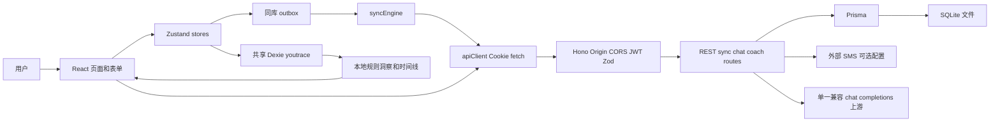
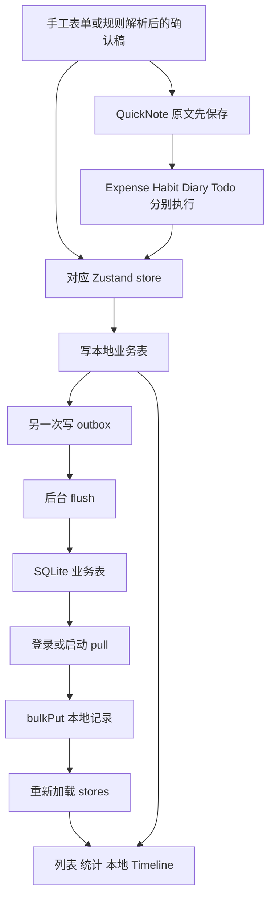
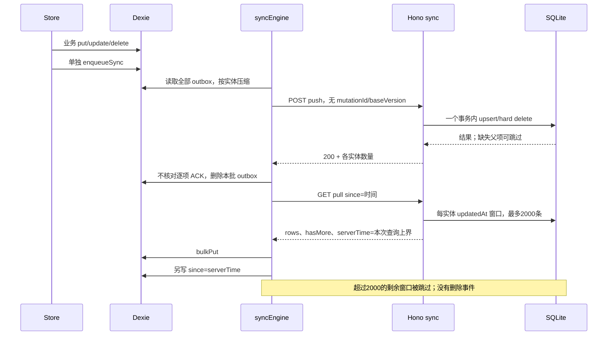
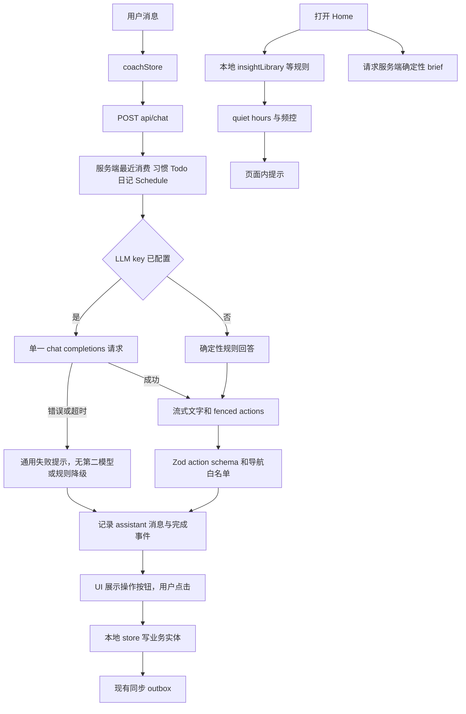
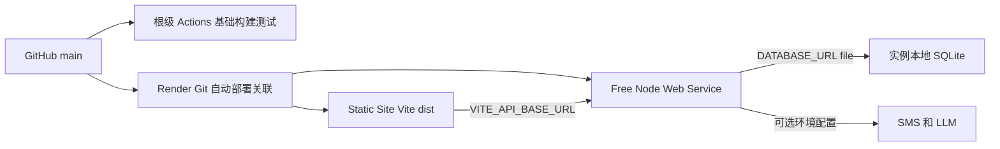

# YouTrace 当前架构与功能对照

审计日期：2026-09-22。代码基线：`4ec3012e0981dda55a37a39fcb56875decd9fe6d`；恢复分支：`recovery/vnext-20260827`。本文描述当前代码，不把目标设计当作已实现能力。风险编号见 [AUDIT_REPORT.md](AUDIT_REPORT.md)。

## 1. 仓库地图与边界

基线跟踪的 TS/TSX 共 117 个文件、约 16,651 行（包含测试）。没有根级 package/workspace 安装编排。前端和后端分别有 package-lock。前端 package version 为 `0.0.0`，后端 `1.0.0`，与文档中的 v2 并非统一发布版本。

| 位置 | 当前职责 | 关键入口/边界 |
| --- | --- | --- |
| `youji-app/src/main.tsx`、`App.tsx` | React 19 SPA，错误边界、初始化和认证加载 | `useAppInit()` 与 `loadUser()` 并行；初始化并未先锁定数据所有者 |
| `src/routes/index.tsx` | React Router、lazy pages、认证/首次访问门禁 | `/goal` 已存在；第 66 行含字面量反引号+n 污染 |
| `src/components/layout/` | desktop/tablet/sidebar、mobile bottom nav | 稳定布局存在，Goal 无显式主入口 |
| `src/pages/`、`src/components/` | 业务页面、表单、弹窗、教练 | ScheduleContent 约 746 行，Settings 约 488 行，QuickNoteResult 约 441 行 |
| `src/stores/` | Zustand 状态、业务写入、读取 IndexedDB | 非统一 repository；业务记录与 outbox 大多分两次写 |
| `src/db/index.ts` | Dexie schema、导出/清除、设置 | 单一 `youtrace` 数据库；v2→v3 主键迁移失败；12 张表 |
| `src/services/syncEngine.ts` | 本地 outbox、push、pull、重试 | 约 397 行；7 种同步实体；时间游标协议 |
| `src/services/apiClient.ts` | Cookie 请求、15s 普通超时、SSE、401 事件 | `youji_has_session` 是本地布尔提示，不是已验证身份 |
| `src/services/parser.ts`、`quickNoteIntegration.ts` | 规则解析、确认后拆分写入 | 无统一事务和幂等 capture ID |
| `src/services/lifeIntelligence.ts`、`coachEngine.ts` 等 | 本地规则洞察、周报、情绪、频控 | 非后台服务；部分读取 Goal |
| `src/stores/coachStore.ts` | 聊天、建议操作、洞察和站内提示 | 约 777 行；在线/离线有不同持久化路径 |
| `server/src/index.ts`、`app.ts` | Node + Hono API、请求大小/Origin/CORS/headers | `createApp()` 可在进程内测试；`/health` 仅验证 `SELECT 1` |
| `server/src/routes/` | 认证、业务 CRUD、sync、chat、coach、user | REST 与 sync 是两套写入入口，后续 ChangeEvent 必须覆盖两者 |
| `server/src/services/` | OTP 安全、SMS、习惯统计、规则解析、模型流解析 | 没有 worker/job 系统 |
| `server/src/utils/` | env、Prisma、Cookie/JWT、时间、限流 | 本地进程内限流；无 session 撤销表 |
| `server/prisma/` | SQLite schema、3 个历史迁移、显式 seed | 空库测试不能证明已有数据升级安全 |
| `.github/workflows/ci.yml` | GitHub 实际根级 CI | 前端 build；后端 generate/build/14 tests；仅 main/master push/PR |
| `youji-app/.github/workflows/ci.yml` | 嵌套的另一份 CI 文件 | 不作为该仓库的根级 GitHub workflow 自动运行 |
| `render.yaml` | 生产 Blueprint | main、Free SQLite、前后端分离；Dashboard 实态未核验 |

表中的 `src/`、`server/` 均相对 `youji-app/`。依赖声明为 React 19、TypeScript、Vite、Zustand、Dexie、Framer Motion、React Router、Tailwind；后端 Hono、Prisma、SQLite、JWT、Zod。2026-09-22 本地安装解析到 Vite 8.2.0、Prisma/@prisma/client 6.19.3、Hono 4.13.0、nanoid 5.1.9。运行环境本地 Node 24.15.0，CI Node 22。

## 2. 当前系统架构图

认证依赖 HttpOnly Cookie，前端不读 JWT。业务本地库却不关联验证后的 userId，因此服务端 ownership 检查不能解决客户端串号。不存在用户隔离 DB factory、session epoch、多标签页切换协调、统一 domain repository 或 durable change feed。

## 3. 当前实体与存储矩阵

以 `src/db/index.ts`、`server/prisma/schema.prisma`、`server/src/app.ts` 为准。`Partial` 表示链路不完整或数据正确性未通过，不代表页面不存在。

| 领域 | 本地 | 服务端/路由 | 当前同步/派生 | 状态与限制 |
| --- | --- | --- | --- | --- |
| Schedule | schedules | Schedule；`/api/schedules` | push/pull；本地时间线；聊天上下文 | Partial；硬删除无传播，remind 不是可靠通知任务 |
| Expense | expenses；金额整数分 | Expense；`/api/expenses` | push/pull；分类/统计；聊天上下文 | Partial；上下文部分支出统计混入收入 |
| Todo | todos | Todo；`/api/todos` | push/pull；本地 Goal 进度规则 | Partial；无 doneAt/version，删除可复活 |
| Habit | habits | Habit；`/api/habits` | push/pull；统计 | Partial；规则进度与真实 Goal 关系未建模 |
| HabitCheckin | habitCheckins，ID 组合键 | HabitCheckin，经 Habit 归属；每日唯一 | push/pull；缺失父项被跳过 | Partial；200 响应不能证明该 mutation 已应用 |
| QuickNote | quickNotes，rawInput/parsed | QuickNote，content/parsed JSON 字符串、BigInt timestamp；`/api/quicknote` | push/pull；本地确认拆分 | Partial；保存原始解析与编辑稿不一致，拆分非事务 |
| Diary | diary，含 quickNoteIds | Diary；`/api/diary`；user/date 唯一 | push/pull；本地时间线 | Partial；服务端无 quickNoteIds；按日冲突覆盖且不回传 ID 映射 |
| Goal | goals | 无对应模型/API | 无同步；lifeIntelligence 周报会统计 | Partial；不可作为云端一等实体 |
| Settings/Profile | settings、auth persist | User 部分字段；`/api/user/settings` | 直接 GET/PATCH，非 outbox | Partial；静默失败；quiet hours 双向不完整 |
| Chat | coachStore 内存 | ChatSession/ChatMessage；`/api/chat` | 在线 API/SSE；不进 sync | Partial；本地导出不含服务端聊天；无操作执行审计 |
| Insight | coachInsights / 内存 | Insight；`/api/coach` | 服务端 brief 与客户端规则双路径 | Partial；dataSources 字符串不是逐条 evidence 关系 |
| Push | coachPushes / 内存 | Push；`/api/coach` | 站内提示/状态 API | Partial；不是 Web Push delivery；登录态本地产生提示未持久保存 |
| Timeline | 无独立表 | 无 ActivityEvent | 页面临时拼接业务表 | Partial；Goal 只有类型映射，没有产生目标事件 |
| Auth | localStorage 认证布尔标志 | User/AuthChallenge/RegistrationTicket | OTP、ticket、JWT Cookie | Partial；无持久 session/revocation/device 管理 |
| Outbox | outbox，自增 seq、entity/op/payload/queuedAt | 无 MutationLedger | success envelope 后删除、部分 4xx 也删 | Partial；本地 seq 不是服务端变化序号/幂等 ID |

七种同步实体大多有服务端 userId/createdAt/updatedAt；HabitCheckin 通过父对象确定所有者。没有统一 version/deletedAt。Chat/Insight/Push 的生命周期字段也不完整。Device、UserMemory、ActivityEvent、EntityRelation、InsightEvidence、ActionProposal/Execution/Outcome、MutationLedger、ChangeEvent、FileAsset、NotificationSubscription/Delivery、IntegrationAccount、AgentRun/ToolCall、Job/JobRun 均未发现完整当前实现，属 Planned。

## 4. 当前数据流图

重要旁路：Settings 直接 PATCH；Chat 使用 API/SSE；登录态 Coach 先读服务端而非全部落到本地；Goal 只写本地。因而“所有数据只从 Dexie 读”只适合部分业务表，不能概括全产品。同步 pull 不保护待同步的本地改动；注销只重置认证并清 outbox，未清/切换业务库和全部内存状态。

导出：`exportAllData()` 收集 11 张本地表（含 Goal），没有 outbox、服务端 Chat 和可靠一致快照，也没有完整导入/恢复验证。清除：`clearAllData()` 清 11 张表（含 outbox、不含 Goal），不是统一事务；账号删除流程复用它。不能把此 JSON 导出称为完整账号备份。

## 5. 当前同步流图（不是目标协议）

证据：客户端 `flush()` 第 92 行、`mergePullPage()` 第 242 行、`pullServerChanges()` 第 353 行、`bootstrapSync()` 第 365 行；服务端 `/pull` 第 117 行、`/push` 第 188 行。所有行号相对对应 sync 文件。

现有优点：服务端 push 使用 transaction、Zod 与 ownership 检查；本地 merge 一页使用 transaction；网络请求设超时，outbox 有定时重试。局限：未确认 mutation 被删、整包无界/超过校验上限、退避被 finally 的 500ms 补偿覆盖、cursor 与数据不原子、无 tombstone/版本冲突/逐项幂等。`online` 只触发 flush，不保证拉取其他设备变化；没有常驻轮询/服务端实时订阅。

## 6. 当前 AI 与主动提示流程

已有 typed action schema（`server/src/routes/chat.ts:214`）、导航路径约束和用户点击，不应误报为完全没有校验/确认。但执行不是权限/幂等/审计/结果闭环；`executed` UI 状态不能替代持久执行记录。没有上游错误分类、Provider Registry、Capability Router、STT/vision/embedding/rerank 管理。

Goal 已进入本地周报，未进入服务端 chat context。近期消费查询部分未排除收入；日记/速记含敏感信息，没有逐类数据授权与 evidence 追溯。模型配置已集中于 `server/src/utils/env.ts` 的三个环境变量，并非所有业务调用都硬编码模型；默认厂商/模型与单一路径依然存在。

Browser SpeechRecognition 是语音主路径，文本输入是已有手工兜底。没有上传、存储、OCR、结构化草稿到实体的图片数据链。没有 background worker、持久 Job、Web Push subscription/service worker。App 不打开，当前页面规则不会在后台自行执行。

## 7. 当前部署图与核验状态

| 项目 | 仓库记录 | 本次实际核验 |
| --- | --- | --- |
| 正式前端 | 用户给定 `https://youtrace-ezu4.onrender.com` | HTTP 请求超时；web 工具也未取得页面 |
| 后端 | `https://youji-api.onrender.com`，health `/health` | 有界只读请求超时；不是已证实服务故障 |
| Origin | Blueprint 写 `https://youtrace.onrender.com` | 与给定真实地址不一致；Dashboard override 未知 |
| DB/plan | `plan: free`，SQLite，未配置 disk | 仓库风险确认；实际实例/数据库/备份未知 |
| 迁移时机 | buildCommand 内 `prisma migrate deploy` | 持久磁盘只能运行时访问，build/pre-deploy 不可访问该盘 |
| SMS | 注释称可选，无 Blueprint 必填项 | 当前生产 OTP 登录实际依赖 SMS；未发送生产验证码 |
| API key/JWT | env 配置，JWT 通过面板提供 | 未查看/输出真实值 |
| CI | main 基线 run 33061636314 成功 | 历史 run 通过，不是本次 recovery CI |

Render 官方说明 Free Web Service 文件在重部署、重启或休眠时丢失且不能挂持久盘；Free Postgres 也有 30 天到期限制，不能据此推荐长期生产免费库。[Free 文档](https://render.com/docs/free)。持久盘不向 build/pre-deploy 提供访问，因此不能只把 `DATABASE_URL` 指向挂载路径而保留当前迁移时机。[Disk 文档](https://render.com/docs/disks)。

## 8. Feature Parity Matrix（功能取舍，不承诺全部恢复）

legacy 参考：`origin/legacy-v1-fastify@ac64c7f21b7bc7cca12894f5dcbeb8beff129838`。与当前 main 无共同祖先。本轮只读代码，不安装/启动旧版、不证明旧版线上可用。表中“代码在”仅指实现线索存在；低/中/高成本是粗粒度相对估计，不是工期报价。

| Feature | Legacy status / 证据（旧树） | v2 status / 证据（当前 youji-app） | Actual user value | Technical cost | Privacy risk | Dependency | Restore? | Redesign? | Priority |
| --- | --- | --- | --- | --- | --- | --- | --- | --- | --- |
| 日程/任务/消费/习惯/日记 | schema、业务 routes 代码在 | Partial；对应 pages/stores/API 已在 | 核心生活记录 | 中 | 高 | 隔离、同步 | 保留当前 | 数据链修复 | P0 |
| Goal | server schema Goal、client 搜索目标分类 | Partial；goalStore/Goal 页面，本地专用 | 长期目标 | 中 | 中 | canonical entity、sync | 恢复完整领域能力 | 是 | P0/P1 |
| 多端同步 | 旧 API 不等于可复用 sync v2 | Partial；syncEngine 与 `/sync` 有数据缺陷 | 保全与跨设备 | 高 | 高 | event/ledger/version | 不搬旧实现 | 是 | P0 |
| 设置与用户画像 | Profile/MemoryItem 等模型在 | Partial；User + 本地 settings | 控制体验与隐私 | 中 | 高 | 账号隔离、字段政策 | 按需要 | 是 | P1 |
| 速记解析 | 旧 AI 服务/记录接口在 | Partial；规则 parser+确认界面 | 降低记录成本 | 中 | 高 | 事务/幂等 capture | 保留并诚实标注 | 是 | P1 |
| 时间线 | 旧聚合视图/记录模型线索 | Partial；Timeline 临时拼表 | 回顾生活 | 中 | 高 | ActivityEvent | 不照搬 | 是 | P1/P2 |
| AI 对话 | agentOrchestrator/AI routes 代码在 | Partial；chat route + SSE | 解释与协助行动 | 中 | 高 | provider配置/权限 | 保留当前基本能力 | 是 | P1/P2 |
| 多模型编排 | agentOrchestrator 中 preferredModel、内存 maps | Planned；单一 LLM env | 故障降级和能力匹配 | 高 | 高 | Provider/Capability | 不直接恢复旧 agent | 是 | P2 |
| 长期记忆 | schema MemoryItem/Profile、共享内存实现线索 | Planned；无可靠长期记忆链 | 持续个性化 | 高 | 极高 | 授权/删除/来源 | 选择性 | 是 | P2 |
| PWA/offline shell | client/vite.config.ts VitePWA、manifest、workbox | Planned；只有 IndexedDB 和静态 assets | 移动入口、离线打开 | 中 | 高 | 账号隔离、安全缓存/更新 | 是 | 是 | P1/P2 |
| Web Push | server routes/push.ts、services/pushService.ts | Planned；页面内 push 并非 Web Push | App 关闭时提醒 | 高 | 高 | worker、subscription | 是，后续 | 是 | P2 |
| Notifications inbox | routes/notification.ts、NotificationPage | Partial；Coach Push/Insight 列表 | 不漏提醒、失败兜底 | 中 | 高 | durable delivery | 是 | 是 | P1/P2 |
| Triggers/jobs | triggerService、node-cron、进程内 map | Planned；Home/app-open 规则 | 主动但可控 | 高 | 高 | Job/Run/lock/retry | 不照搬内存 cron | 是 | P2 |
| 附件/上传 | routes/upload.ts、Attachment、Uploader/Preview | Planned；无完整链 | 保留图片文件证据 | 高 | 极高 | 对象存储/ACL/删除 | 有价值时恢复 | 是 | P2 |
| OCR/Vision | upload 中 annotateWithMimo 路径 | Planned | 从票据/图片生成草稿 | 高 | 极高 | 附件、provider、确认 | 选择性 | 是 | P2 |
| Global search | GlobalSearch、routes/search.ts，覆盖 diary/attachment/event/chat/goal/habit | Planned；无统一 search | 找回生活记录 | 中高 | 高 | canonical data、ACL | 是 | 是 | P1/P2 |
| Weather | WeatherPage、weatherService/routes | Planned | 情境辅助，非核心 | 中 | 中 | 第三方 API | 暂缓 | 如恢复需降级 | P3 |
| Location | locationStore/routes/location.ts | Planned | 有授权的地点上下文 | 中高 | 极高 | permission/retention | 暂缓 | 是 | P3 |
| Statistics/reviews | StatsPage 代码在 | Partial；消费统计、weekly/lifeIntelligence | 可解释回顾 | 中 | 高 | 数据质量/evidence | 保留有价值部分 | 是 | P1/P2 |
| Voice | 本轮未确认独立服务端 STT 链 | Partial；QuickNote 浏览器识别+文本兜底 | 便捷 capture | 高 | 高 | STT/录音授权 | 不声称旧版已成熟 | 是 | P2 |
| Brand/版本统一 | 多位置品牌资源 | Partial；名称/assets/version 分散 | 一致性 | 低中 | 低 | config registry | 不照搬资源全量 | 是 | P3 |

旧版 PWA 的通用 `api-cache` 按 URL 缓存 API 响应，没有在该配置中建立账号隔离；旧 agent 的 Map 和 cron 也不是可靠持久执行基础。恢复的是用户价值，不是把旧源码搬回当前树。

## 9. 本文不证明的能力

生产真实数据量/持久化、Dashboard 配置、真实 SMS/模型调用、跨域 Cookie 浏览器兼容性、全部按钮业务结果、键盘/屏幕阅读器、长期离线和大量数据性能、旧版实际可用性，均不能从结构图推导为通过。详见审计报告的测试与 `BLOCKED_EXTERNAL` 部分。
